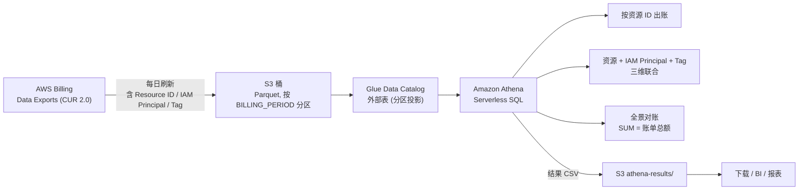
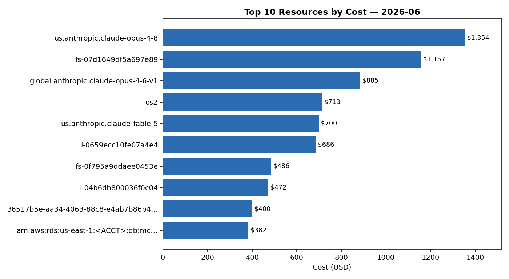
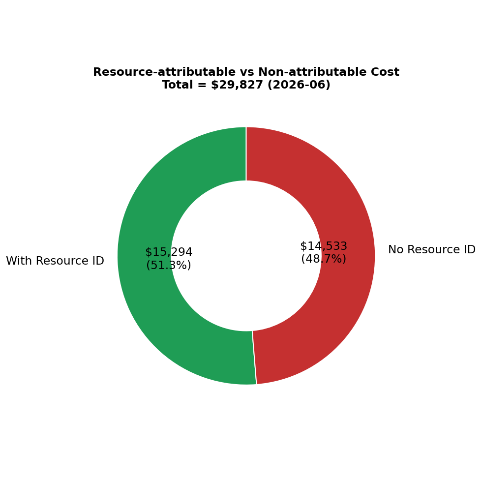
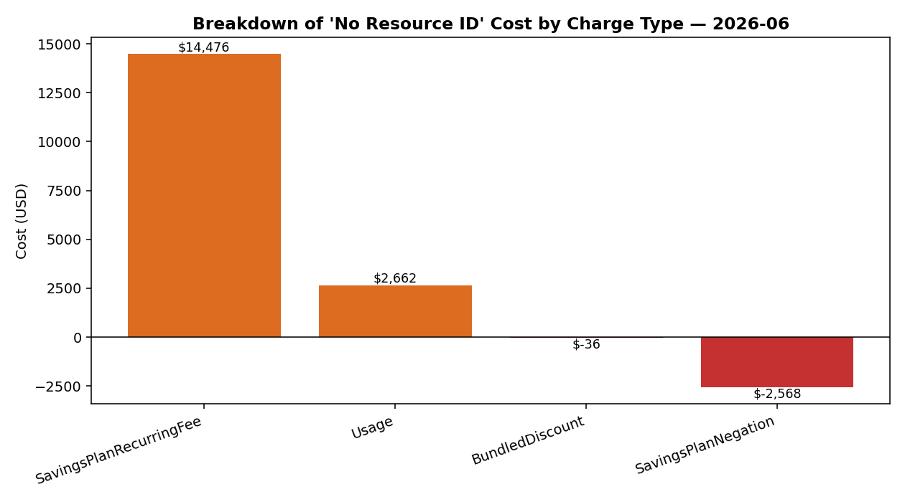

# 用 CUR 2.0 + Athena 做 AWS 资源级成本分析：从找账单到全景对账的完整实践

> 说明：本文中的 AWS 账号 ID、资源 ARN 等已做脱敏处理（统一替换为占位符），数据金额为真实环境脱敏后的实测值，用于演示分析方法。

## 背景

AWS 默认的账单是**按服务汇总**的——你能看到 "Amazon Bedrock 花了多少、EC2 花了多少"，但看不到**具体是哪个资源、哪个人、哪个项目**在花钱。当账单开始变大，尤其是有大量 Bedrock 调用、HPC 集群、多团队共用一个账号时，"按资源 ID 出账单"就成了刚需。

这篇文章完整记录我把这件事落地的全过程：

1. 定位已开启的 CUR（很多人开了却不知道数据在哪）
2. 在 Athena 里建表，让 Parquet 数据可查
3. 按资源 ID 出账
4. 进阶：把 IAM Principal（谁在花钱）和 Tag（哪个项目/团队）一起统计
5. **最关键的一步**：做全景对账，结果发现近一半费用根本没有资源 ID

最后一步颠覆了我对"资源级成本分析"的认知，建议直接跳到第 5 节看结论。

## 整体架构



---

## 0. 前置知识：CUR 到底是什么

**Cost and Usage Report (CUR)** 是 AWS 提供的最细粒度账单数据，每一行是一个计费项（line item），可以细到小时级、带资源 ID、带标签。它有两代：

- **Legacy CUR**：通过 `cur` API 管理
- **CUR 2.0 / Data Exports**：新版，通过 `bcm-data-exports` API 管理，schema 更规整

数据以 CSV 或 Parquet 落到你指定的 S3 桶，然后通常用 **Amazon Athena**（基于 Presto 的 Serverless SQL）来查询。

---

## 1. 定位已开启的 CUR

我之前开过 CUR，但忘了数据落在哪个桶。先查 Legacy：

```bash
aws cur describe-report-definitions --region us-east-1
# 返回 ReportDefinitions: []  —— 空的，说明不是 Legacy
```

> 注意：CUR / Data Exports 是全局服务，API 统一在 `us-east-1`。

再查新版 Data Exports：

```bash
aws bcm-data-exports list-exports --region us-east-1
```

果然在这里，找到两个导出。逐个看详情：

```bash
aws bcm-data-exports get-export --region us-east-1 --export-arn <EXPORT_ARN>
```

关键是看这几个字段：

| 字段 | 含义 |
|------|------|
| `S3Bucket` / `S3Prefix` | 数据在哪 |
| `INCLUDE_RESOURCES` | **是否含资源 ID（决定能不能按资源出账）** |
| `INCLUDE_IAM_PRINCIPAL_DATA` | 是否含 IAM Principal |
| `TIME_GRANULARITY` | HOURLY / DAILY / MONTHLY |

我的两个导出对比：

| 导出 | INCLUDE_RESOURCES | 粒度 | 格式 | 能否按资源出账 |
|------|-------------------|------|------|----------------|
| export-A | ✅ TRUE | HOURLY | Parquet | ✅ 可以 |
| export-B | ❌ FALSE | MONTHLY | CSV | ❌ 不行 |

**教训一**：开 CUR 时一定要勾选 "Include resource IDs"，否则拿不到资源粒度。我用的是 export-A。

---

## 2. 在 Athena 里建表

### 2.1 先读 Manifest 拿精确 schema

CUR 2.0 的 Parquet 里有几个嵌套字段（`product`、`resource_tags`、`tags`、`cost_category`、`discount`）是 `map` 类型，靠手写 DDL 很容易类型对不上。最稳的办法是读导出自带的 Manifest：

```bash
aws s3 cp \
  "s3://<BUCKET>/<PREFIX>/<EXPORT>/metadata/BILLING_PERIOD=2026-06/<EXPORT>-Manifest.json" - \
  --region us-east-1
```

Manifest 的 `columns` 数组里每列都有 `name` 和 `type`。把 `map` 映射成 Athena 的 `map<string,string>`，其余 string/double/timestamp 照搬即可。

### 2.2 建表 DDL（用分区投影，免去手动加分区）

数据按 `BILLING_PERIOD=2026-06` 这样的 Hive 风格目录分区。我用**分区投影（partition projection）**，这样新月份数据落到 S3 后无需再跑 `MSCK REPAIR TABLE`：

```sql
CREATE DATABASE IF NOT EXISTS cur_db;

CREATE EXTERNAL TABLE IF NOT EXISTS cur_db.cur_report (
  -- ... 100+ 列，map 字段写成 map<string,string> ...
  line_item_resource_id string,
  line_item_iam_principal string,
  line_item_unblended_cost double,
  resource_tags map<string,string>,
  tags map<string,string>
  -- ...
)
PARTITIONED BY (billing_period string)
STORED AS PARQUET
LOCATION 's3://<BUCKET>/<PREFIX>/<EXPORT>/data/'
TBLPROPERTIES (
  'projection.enabled' = 'true',
  'projection.billing_period.type' = 'date',
  'projection.billing_period.format' = 'yyyy-MM',
  'projection.billing_period.range' = '2026-05,NOW',
  'projection.billing_period.interval' = '1',
  'projection.billing_period.interval.unit' = 'MONTHS',
  'storage.location.template' = 's3://<BUCKET>/<PREFIX>/<EXPORT>/data/BILLING_PERIOD=${billing_period}'
);
```

> 完整 100+ 列的 DDL 较长，建议直接从 Manifest 脚本生成。

### 2.3 通过 CLI 跑 Athena 查询

`primary` workgroup 默认没配结果输出位置，查询时显式指定即可：

```bash
QID=$(aws athena start-query-execution --region us-east-1 \
  --work-group primary \
  --result-configuration OutputLocation=s3://<BUCKET>/athena-results/ \
  --query-string "SELECT ...;" \
  --query QueryExecutionId --output text)

aws athena get-query-execution --region us-east-1 --query-execution-id "$QID"
aws athena get-query-results  --region us-east-1 --query-execution-id "$QID"
```

---

## 3. 按资源 ID 出账（核心需求）

```sql
SELECT
    line_item_resource_id        AS resource_id,
    line_item_product_code       AS service,
    product_region_code          AS region,
    SUM(line_item_unblended_cost) AS cost_usd
FROM cur_db.cur_report
WHERE billing_period = '2026-06'
  AND line_item_resource_id <> ''
GROUP BY 1, 2, 3
ORDER BY cost_usd DESC;
```

实测 Top 5（脱敏后）：

| 资源 | 服务 | 成本 (USD) |
|------|------|-----------|
| Bedrock inference-profile / claude-opus-4-8 | Bedrock | 1,354.44 |
| FSx 文件系统 | FSx | 1,157.01 |
| Bedrock inference-profile / claude-opus-4-6 | Bedrock | 884.67 |
| OpenSearch domain | OpenSearch | 712.69 |
| Bedrock inference-profile / claude-fable-5 | Bedrock | 699.55 |



成本字段一律用 `line_item_unblended_cost`（未混合成本，最贴近账单）。每个查询都带 `billing_period = 'YYYY-MM'`，能大幅减少扫描量、降低 Athena 费用。

---

## 4. 进阶：把 IAM Principal 和 Tag 一起统计

### 4.1 IAM Principal —— 谁在花钱

如果导出开了 `INCLUDE_IAM_PRINCIPAL_DATA=TRUE`，就有一列 `line_item_iam_principal`，记录产生费用的 IAM 用户/角色 ARN。直接加进 SELECT/GROUP BY：

```sql
SELECT
    line_item_resource_id   AS resource_id,
    line_item_iam_principal AS iam_principal,
    SUM(line_item_unblended_cost) AS cost_usd
FROM cur_db.cur_report
WHERE billing_period = '2026-06'
  AND line_item_iam_principal <> ''
GROUP BY 1, 2
ORDER BY cost_usd DESC;
```

实测能看到同一个 Bedrock 推理配置被拆给不同的 principal——比如一个 IAM user 和一个 `assumed-role/.../i-xxxx`（EC2 上的角色）。这对多人共用模型时的成本归因极有价值。

**坑**：`line_item_iam_principal` 主要由 Bedrock 这类服务填充，大部分基础设施资源（EC2、FSx、RDS）这一列是空的。

### 4.2 Tag —— 哪个项目/团队

Tag 不是独立列，而是放在 `resource_tags`（`map<string,string>`）里。**用户自定义 tag 的 key 在 CUR 2.0 中带 `user_` 前缀**。先动态发现有哪些 key：

```sql
SELECT tk AS tag_key, SUM(line_item_unblended_cost) AS cost_usd
FROM cur_db.cur_report
CROSS JOIN UNNEST(map_keys(resource_tags)) AS t(tk)
WHERE billing_period = '2026-06'
GROUP BY tk
ORDER BY cost_usd DESC;
```

我的环境里有：`user_name`、`user_project`、`user_owner`、`user_parallelcluster_cluster_name`。

### 4.3 三维合一

```sql
SELECT
    line_item_resource_id                                          AS resource_id,
    COALESCE(NULLIF(line_item_iam_principal,''),'(no principal)')  AS iam_principal,
    COALESCE(NULLIF(resource_tags['user_project'],''),'-')         AS tag_project,
    COALESCE(NULLIF(resource_tags['user_owner'],''),'-')           AS tag_owner,
    SUM(line_item_unblended_cost)                                  AS cost_usd
FROM cur_db.cur_report
WHERE billing_period = '2026-06' AND line_item_resource_id <> ''
GROUP BY 1, 2, 3, 4
ORDER BY cost_usd DESC;
```

**教训二**：资源 ID、IAM Principal、Tag 这三个维度往往是**互补的，很少同时出现在同一行**：

- Bedrock 资源：有 IAM Principal，但没 Tag（推理配置打不了 tag）
- 基础设施资源（EC2/EFS/FSx）：有 Tag，但没 IAM Principal

所以放在一张表里能得到全景视图，但别指望每行三者都齐全。空值用占位符填充。

---

## 5. 最关键的一步：全景对账（不丢数据）

到这里看起来已经很完整了。但我做了一件事：**把所有按资源的查询去掉 `line_item_resource_id <> ''` 过滤，看看到底丢了多少。**

### 5.1 全景查询

```sql
SELECT
    COALESCE(NULLIF(line_item_resource_id,''),'(no resource id)')  AS resource_id,
    COALESCE(NULLIF(line_item_iam_principal,''),'(no principal)')  AS iam_principal,
    line_item_product_code                                         AS service,
    line_item_line_item_type                                       AS charge_type,
    SUM(line_item_unblended_cost)                                  AS cost_usd
FROM cur_db.cur_report
WHERE billing_period = '2026-06'
GROUP BY 1, 2, 3, 4
ORDER BY cost_usd DESC;
```

### 5.2 对账校验

```sql
SELECT SUM(line_item_unblended_cost) AS grand_total_usd, COUNT(*) AS raw_line_items
FROM cur_db.cur_report
WHERE billing_period = '2026-06';
```

把全景表所有行的 `cost_usd` 加起来，和这个 `grand_total` 对比：

| 指标 | 值 |
|------|-----|
| 当月账单总额 | **$29,827.01** |
| 原始明细行数 | 1,142,147 |
| 全景表分组行数 | 3,742 |
| 全景表 cost 合计 | **$29,827.01** |
| 差异 | **0.000000** ✅ |

一分钱不差。



### 5.3 颠覆认知的发现

那么，之前带资源 ID 过滤的查询丢了多少？我单独统计"无资源 ID"的部分：

| charge_type | 成本 (USD) |
|-------------|-----------|
| SavingsPlanRecurringFee | 14,475.58 |
| Usage（主要是 Support 费用） | 2,661.78 |
| BundledDiscount | -35.77 |
| SavingsPlanNegation | -2,568.41 |
| **无资源 ID 合计** | **14,533.18（占总额 48.7%）** |

**近一半的账单没有资源 ID！**



这些费用天生就不归属任何具体资源：

- **Savings Plan 月承诺费**（`SavingsPlanRecurringFee`）：你承诺的固定额度
- **Support 套餐费**：按账单百分比收，不挂在资源上
- **整笔折扣 / SP 抵消项**：负数行

> Savings Plan 的记账机制：`SavingsPlanRecurringFee`（月费，无资源 ID）+ `SavingsPlanNegation`（抵消按需价，负数）+ `SavingsPlanCoveredUsage`（被覆盖的用量，记在具体资源上）。三者合计才是净成本。

**教训三（最重要）**：**只做资源级查询会漏掉将近一半账单。** 任何"按资源/按团队分摊成本"的方案，都必须搭配全景对账，否则分摊出来的数字加起来对不上真实账单，FinOps 报告会失去公信力。

---

## 6. 总结与最佳实践

1. **开 CUR 必勾 "Include resource IDs"**，否则一切无从谈起。
2. **用 Manifest 生成 DDL**，别手写 map 字段类型。
3. **分区投影**省去手动维护分区。
4. **成本字段用 `line_item_unblended_cost`**；要看摊销视角再用 `reservation_effective_cost` / `savings_plan_..._effective_cost`。
5. **资源 ID / IAM Principal / Tag 三维互补**，合表看全景，但别期望每行都全。
6. **永远做全景对账**：`SUM` 应等于账单总额。记住"无资源 ID"那部分（SP 月费、Support、整笔折扣）可能占到一半。
7. 查询带上 `billing_period` 分区过滤，省钱省时。

> 提醒：本文方法用于分析**历史/当前**成本。未来价格预测请用 AWS 官方的 [Pricing Calculator](https://calculator.aws)。

---

## English Summary (TL;DR)

This post records an end-to-end implementation of **resource-level AWS cost analysis** using **CUR 2.0 (Data Exports) + Amazon Athena**:

1. **Locate the CUR** — Legacy CUR (`aws cur describe-report-definitions`) was empty; the data lived in the newer `aws bcm-data-exports list-exports`. Always verify `INCLUDE_RESOURCES=TRUE`, otherwise there is no resource granularity.
2. **Create the Athena table** — read the export's `Manifest.json` for the exact schema (the `map` columns must be `map<string,string>`), and use **partition projection** on `billing_period` so new months are queryable without `MSCK REPAIR`.
3. **Bill by resource ID** — group by `line_item_resource_id`, summing `line_item_unblended_cost`.
4. **Add IAM Principal & Tags** — `line_item_iam_principal` is a real column (when enabled); tags live inside the `resource_tags` map with a `user_` prefix. The three dimensions are *complementary*: Bedrock rows have a principal but no tags; infra resources (EC2/EFS/FSx) have tags but no principal.
5. **Panorama reconciliation (key finding)** — removing the `resource_id <> ''` filter and reconciling against the grand total revealed that **48.7% ($14,533 of $29,827) of the bill has NO resource ID** — mostly Savings Plan recurring fees and Support charges. **Resource-only queries silently hide nearly half the bill.** Any cost-allocation report must reconcile to the grand total.

**Key takeaways:** enable resource IDs; generate DDL from the Manifest; use partition projection; always reconcile; remember that SP recurring fees, Support, and bundled discounts carry no resource ID.

---

## 附录：完整 SQL

完整建表 DDL 与全部查询（Q1–Q16，含按资源、按 Principal、按 Tag、全景、对账）见配套文件 `cur_athena.sql`。

*本文为实施记录，欢迎转载，请注明出处。*
